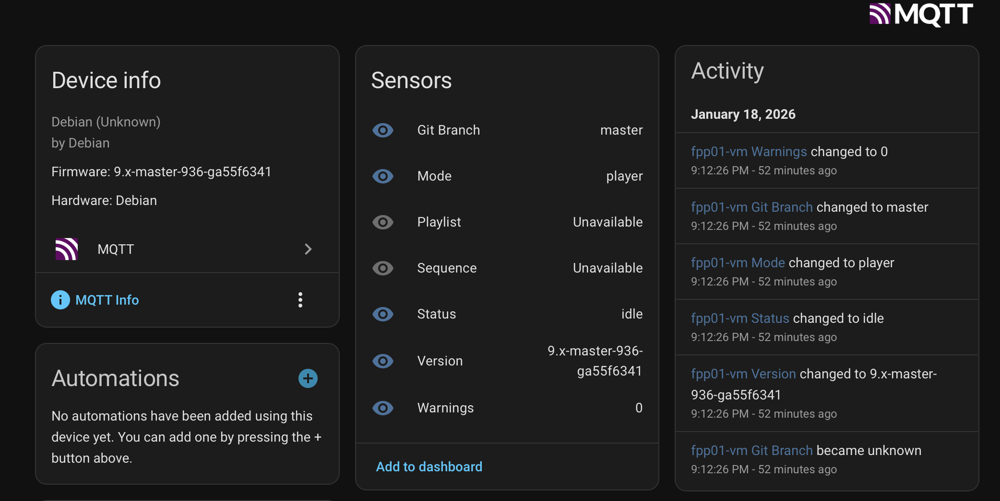

# fpp-ha-discovery

Welcome to the FPP Discovery Plugin

This plugin publishes the auto discovery payload to create a device in HA for this FPP instance. It also configures some basic sensors. The following sensors are explicitly created and associated to the device.

* FPP Version
* GIT Branch
* Status: Playing or Idle
* Sequence Name
* Playlist Name
* Mode: Player or Remote
* Warnings: The number of warnings shown in the red bar in FPP if any.

In addition, all the fields published on the fpp_status topic are made available as attributes on the status sensor.

## Purpose

The purpose of this is to save time manually creating the device and sensors in HA for all my FPP instances. These are used to create monitoring automations for my light show.

Improvement PR's are welcome.

